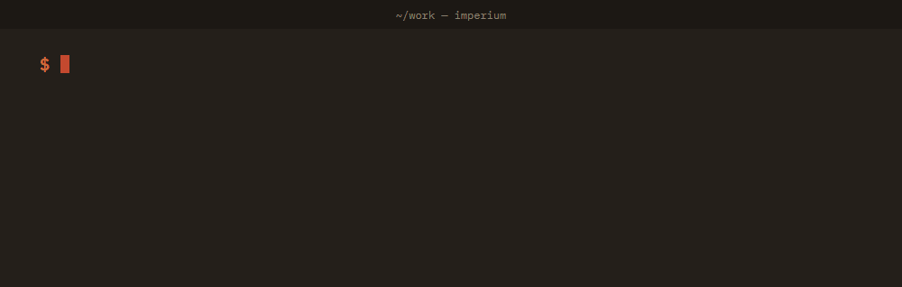

<p align="center">
  
</p>

# Imperium: a supervisor for AI coding agents

**Imperium is an open-source, local supervisor for AI coding agents such as Claude Code, OpenCode, Codex and Gemini
CLI.** It sits between the AI that plans the work (the *director*), the coding agents that do it (the *builders*),
and you (the *owner*). It records delivery outcomes, exposes uncertainty and pending decisions, and separates an
agent's completion claim from verification and acceptance.

**Pre-alpha:** OpenCode HTTP and ACP have small published demonstrations; other ACP integrations need product-specific
validation. See the [capability matrix](docs/ADAPTERS.md) and [validation limits](docs/VALIDATION.md).

The control service uses Python's standard library and SQLite. Verification defaults to a restricted Docker
container and requires a locally prepared image; it never silently executes candidate code on the host.

[](https://github.com/parnish007/imperium/actions/workflows/tests.yml)


## The problem it solves

Running AI coding agents for hours without watching them fails in ways that are easy to miss:

- a prompt is **sent twice** after a timeout, or **silently lost** in a client-side queue;
- the agent sits on a **permission prompt** nobody saw;
- the orchestrating session's monitor dies and **events are never read**;
- the agent says **"done"** when half the work is done, or deletes the failing test so the suite passes;
- a **sub-agent** is still working while the main agent looks idle, and the next prompt interrupts it.

Imperium makes each of these visible, recorded and recoverable.

## Features

- **Delivery with proof.** Every instruction ends in a recorded outcome. "Delivered" means Imperium found its own
  message id in OpenCode's history; ACP uses matching-session turn activity or the prompt response. Uncertain
  cases wait for a decision; Imperium never resends on its own. HTTP readiness includes observed descendants;
  ACP readiness covers its current session only, with subagent visibility explicitly unknown.
- **Verified work, not claimed work.** Work is organised in *rounds*. An agent's "done" is a claim. It becomes
  *verified* only when trusted checks pass on a snapshot of the code, in a fresh copy outside the live workspace,
  with the checks' own files unchanged. When `must_fail_on_base` is configured, the baseline must produce the
  expected test-failure exit code, not a timeout or setup error. It is *accepted* only by
  a named person or director.
- **Permission approvals with a human in the loop.** Your rules can answer an agent's permission prompts
  automatically, but only while the director is present, and every automatic answer is listed for you to review.
  Deny rules always win.
- **An event journal you can trust.** One append-only journal with a hash chain; each reader has its own feed and
  bookmark, and nothing is marked read before it was shown. Integrity failures stop everything that acts until you
  inspect them.
- **Liveness with adapter-specific visibility.** Working, waiting for approval, waiting for an answer, stalled, hung:
  reported, never killed behind your back.
- **Works with your agents.** OpenCode over its HTTP server, and any agent that speaks the
  [Agent Client Protocol](https://agentclientprotocol.com) (ACP), which Imperium starts and drives itself: OpenCode,
  Gemini CLI, and Claude Code or Codex through their ACP adapters.
- **Built for Claude Code as the director.** A generated Claude Code plugin with an MCP server, hooks and a
  playbook skill; any MCP client can use the director tools.
- **Isolation mode.** Run agents under their own operating-system account and let them reach Imperium only through
  a named pipe (Windows) or Unix socket (Linux, macOS) that checks who is at the other end.
- **Notifications, dashboard, backups.** A command of your choice runs for anything that needs you; a read-only
  browser dashboard; online backups and crash-safe restore.

## How it works

```
  Director (an AI session)        Owner (you)
  MCP tools · CLI · hooks         CLI · read-only dashboard · notifications
              \                     /
               v                   v
      imperiumd: one local service, the only writer
        local API on 127.0.0.1, bearer tokens (or OS-checked pipes in isolation mode)
        SQLite journal with an integrity chain
        delivery · rounds and checks · approvals · liveness
               |                        |
               v                        v
      OpenCode server (HTTP)     any ACP agent (stdio, started by Imperium)
```

The guarantees, and exactly what each one does *not* cover, are in the [specification](docs/SPEC.md).

## Install

Requires Python 3.11 or newer and Git. Safe verification additionally requires Docker with Linux containers. [`uv`](https://docs.astral.sh/uv/) is the easiest way to get one.

```
git clone https://github.com/parnish007/imperium.git
cd imperium
uv tool install .        # or: pip install .
```

## Quick start

Use one OpenCode HTTP builder first. [Prepare the verification image](docs/VERIFICATION.md) and set
`[verification] image` in your config before running a check. The image needs `python3` and the dependencies your
check uses (the pytest example below needs pytest installed). Existing installations must also configure it;
missing configuration refuses verification. Run `imperium doctor` to see setup warnings.

```
imperium init                      # ~/.imperium (or $IMPERIUM_HOME): database, config, owner token
# Set [verification] image in ~/.imperium/imperium.toml as described above.
imperium up                        # start the background service

# a builder: an OpenCode session (from `opencode serve`) ...
imperium builder add coding --endpoint http://127.0.0.1:<port> --session <ses_id> --directory <repo>
imperium builder mcp-config coding --write    # gives it Imperium's report tool; restart OpenCode while idle

# Alternative after the HTTP workflow: an ACP agent; see the capability matrix
imperium builder add helper --acp "opencode acp" --directory <repo>

# a trusted check: run on a snapshot, never in the live workspace
imperium check add unit --builder coding --depends tests/test_calc.py --must-fail-on-base -- python -m pytest -q

# one round of work
imperium round open coding --objective "Make add() add; tests/test_calc.py must pass."
imperium round verify <round> --wait 600
imperium round objective <round> met
imperium round accept <round>      # refused unless verified and the workspace is unchanged
```

Use Claude Code as the director:

```
imperium plugin write ~/imperium-plugin       # skill, MCP server, hooks
claude --plugin-dir ~/imperium-plugin
imperium --as owner director claim            # once, inside that session
```

Everyday commands:

```
imperium status / events / ack <seq> / show <seq>      # what happened; your feed and bookmark
imperium send coding --message "..." --key k1           # a message outside rounds
imperium queue / msg show <id> / msg resolve <id> wait|cancel|resend --confirm-may-run-twice
imperium approvals / approve <id> / deny <id>           # permission prompts; --auto lists what your rules answered
imperium rule add bash "git status*" --allow            # owner rules, used only while the director is present
imperium questions / answer <id> --choice "A"
imperium dashboard                                      # read-only view in your browser
imperium stop-all / resume-all                          # pause dispatch / owner resumes
imperium abort-all                                     # also request cancellation; inspect status for outcomes
imperium backup / restore <file> / verify-journal / export --out f.jsonl / doctor / down
```

The [step-by-step guide](HOWTOUSE.md) walks through all of this in detail. Every command takes `--json`. Configuration lives in `~/.imperium/imperium.toml`; to be notified outside the feed,
set `[notify] command` (see the [specification](docs/SPEC.md), section 7.1).

## How a round is verified

1. When the round opens, its brief (objective, nonce, how to report, when to escalate) is queued, and the code is
   snapshotted just before it is sent.
2. The agent reports `ready` through its tool, quoting the round's nonce and generation. A claim is evidence, not
   acceptance.
3. `round verify` snapshots the code again. Changed check dependencies refuse the whole job before execution.
   Trusted checks run in fresh restricted containers by default. Baseline checks require their configured
   assertion-failure exit code. Provenance records image identity, command, environment names/hashes, exit code
   and bounded output. Only the owner can approve changed check versions.
4. A person or the director records whether the objective is met. Only then is the round verified.
5. Accept is refused if the workspace changed since the verified snapshot. A follow-up message starts a new
   generation and voids the verification.

## Scope and comparisons

Imperium focuses on delivery accounting and evidence-gated acceptance. It does not yet have measured comparative
results against other supervisors or direct agent use. The [evaluation protocol](docs/VALIDATION.md) describes
what must be measured before claiming better task quality, reliability or productivity.

## Measured

- 600 messages under random faults (dropped connections, servers that answer before saving, crashes right after a
  request): **0 without a recorded outcome, 0 silent duplicates** in the fake-server harness. This is not a task-success rate.
- Idle service: about **29 MB** of memory.
- Real rounds against OpenCode, over HTTP and over ACP: brief delivered, code fixed, checks passed on the change and
  failed without it, accepted.

Details and how to reproduce them: [docs/benchmarks.md](docs/benchmarks.md).

## Security model

- **Builder processes are not automatically sandboxed.** An agent running as your operating-system user can do anything you can, including
  reading Imperium's files. A prompt-injected agent is a realistic way for that to happen. For containment, run
  agents under another account ([isolation mode](docs/ISOLATION.md)), in a container or in a VM.
- Candidate verification runs in a restricted Docker container by default; see [the runner threat model](docs/VERIFICATION.md).
- Without isolation mode, "owner-only" holds against software that follows the protocol, not against a hostile
  process running as you.
- The local API listens on `127.0.0.1` only, checks `Host` and `Origin` (which stops web pages), and needs a
  256-bit bearer token; tokens are stored hashed.
- Nothing Imperium runs in an agent's repository executes the agent's git configuration (filters, diff drivers,
  hooks).
- The journal's hash chain detects corruption and naive edits; a process running as you could recompute it.

## FAQ

**What is Imperium?**
A local, open-source supervisor for AI coding agents. It records delivery evidence or uncertainty and requires
configured verification evidence plus an explicit decision to accept work. A feed acknowledgement proves a
protocol action, not that a human or model understood the event. See the specification for exact limits.

**Which coding agents does it work with?**
OpenCode (attached to a running `opencode serve` session) and any Agent Client Protocol agent: OpenCode, Gemini
CLI, and Claude Code or Codex through their ACP adapters. Live runs so far used OpenCode over both routes.

**Can Claude Code supervise other agents with it?**
Yes. `imperium plugin write` generates a Claude Code plugin with an MCP server, hooks and a playbook, so a Claude
Code session can send work, read events, answer approvals, and verify and accept rounds.

**How does it stop an AI agent from faking "tests pass"?**
Checks are defined through the control plane. Changed dependencies prevent execution until owner approval.
Checks run on snapshots in restricted containers by default. Optional baseline discrimination requires a
configured test-failure outcome. This provides evidence; it cannot establish that incomplete tests cover the
whole objective or protect owner credentials from a builder running as the same OS user.

**Does it retry failed prompts automatically?**
No. A prompt whose fate is unknown becomes *uncertain* and waits for a decision (wait, cancel, or resend knowing it
may run twice). Silent retries are how instructions run twice.

**Does it need the cloud or an API key?**
The control service needs no cloud account or model key. Your agents use their configured model providers.
Verification requires Docker and a prepared image unless you explicitly select unsafe local development mode.

**Is it a sandbox?**
The verification runner provides a container boundary. Builder and director processes need separate isolation;
see the security model, [verification guide](docs/VERIFICATION.md) and [isolation mode](docs/ISOLATION.md).

**Which operating systems?**
Windows, Linux and macOS; tested on all three with Python 3.11 and 3.13.

## Documentation

- [How to use Imperium](HOWTOUSE.md): step-by-step guide, from install to everyday use
- [Specification](docs/SPEC.md): every guarantee, state and limit
- [Verification and migration](docs/VERIFICATION.md): container setup, trusted checks and baseline outcomes
- [Adapter capabilities](docs/ADAPTERS.md): observed support, progress and cancellation semantics
- [Validation](docs/VALIDATION.md): regression map and real-agent evaluation protocol
- [Isolation mode](docs/ISOLATION.md): agents under their own account
- [Benchmarks](docs/benchmarks.md): measured numbers and the comparison sources

## Tests

The tests are part of the product: crash and fault cases, tampering, restore, idempotency, hostile
repositories, isolation channels, a fake OpenCode server with its known quirks and a fake ACP agent run as a real
process. They run on Windows, Linux and macOS.

```
PYTHONPATH=src python -m unittest discover -s tests
```

## Licence

MIT. See [LICENSE](LICENSE).
